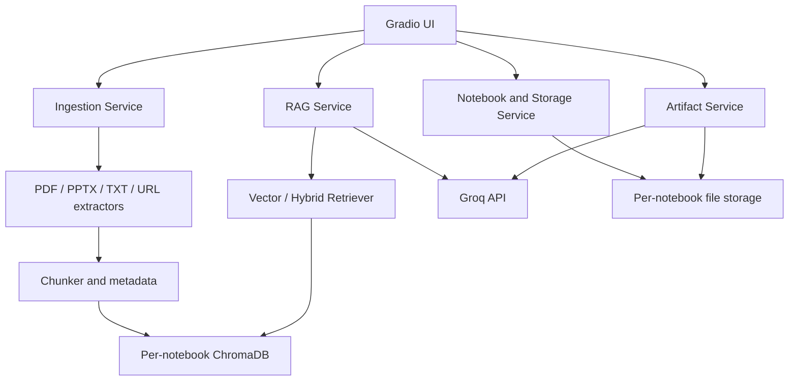
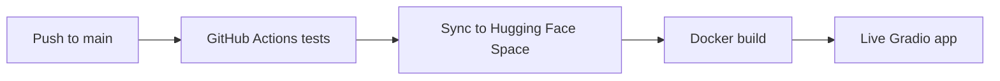

# Architecture

## Component Diagram



## Major Modules

| Module | Responsibility |
|---|---|
| `app.py` | Gradio workflow, input validation, and user-facing errors |
| `storage.py` | Notebook CRUD and persistent source/chat/artifact storage |
| `ingestion.py` | Safe URL handling, extraction, cleanup, chunking, metadata |
| `retrieval.py` | ChromaDB indexing, vector search, BM25, rank fusion |
| `services.py` | Grounded RAG prompt, citations, chat persistence, timings |
| `artifacts.py` | Source-grounded Markdown reports and quizzes |
| `llm.py` | Groq API boundary and secret handling |

## Notebook Data Model and Storage

Each notebook has an immutable UUID. Renaming changes metadata, not its storage
identity. This prevents name collisions and ensures sources never cross notebook
boundaries.

```text
data/notebooks/<uuid>/
├── metadata.json
├── sources.json
├── raw/
├── extracted/
├── vector_db/
├── chats/history.json
└── artifacts/*.md
```

Writes to JSON metadata use a temporary file followed by an atomic replacement.
`StorageBackend` defines the abstraction boundary; `LocalStorage` is the current
implementation and can later be replaced by object/database storage.

## Ingestion Data Flow

1. Validate notebook, extension/URL, and file size.
2. Copy the raw source under its generated source UUID.
3. Extract page, slide, text-file, or web-page content.
4. Clean text and create overlapping chunks.
5. Attach source name, type, location, URL, and chunk ID.
6. Embed and upsert into that notebook's ChromaDB collection.
7. Save source metadata and extracted text.

## RAG Pipeline

The selected retriever returns four chunks. Vector mode uses cosine similarity.
Hybrid mode fuses vector and BM25 rankings through Reciprocal Rank Fusion. The
LLM receives labeled contexts `[S1]...[S4]`, a strict no-outside-facts rule, and
an insufficient-evidence instruction. The UI exposes citations, chunk excerpts,
scores, retrieval method, and response time. Messages are persisted after a
successful answer.

## Artifact Generation

The report and quiz services read indexed notebook chunks, build a bounded
context, and ask Groq-hosted GPT-OSS for Markdown grounded in those sources. Reports contain
sections and references. Quizzes contain multiple-choice and short-answer items,
followed by an answer key and source references. Files are stored in the active
notebook and returned for preview/download.

## Deployment Architecture



`HF_TOKEN` and `HF_SPACE_REPO` are GitHub Secrets. `GROQ_API_KEY` is a Hugging
Face Space Secret. No credentials are stored in source control.

## Storage Limitation

Local execution persists data across restarts. Free Hugging Face Space disk may
be erased on rebuild or restart. The application documents this limitation as
permitted by the assignment. A production deployment can use Hugging Face
Persistent Storage by setting `APP_DATA_DIR=/data`, or replace `LocalStorage`
with durable external storage.
